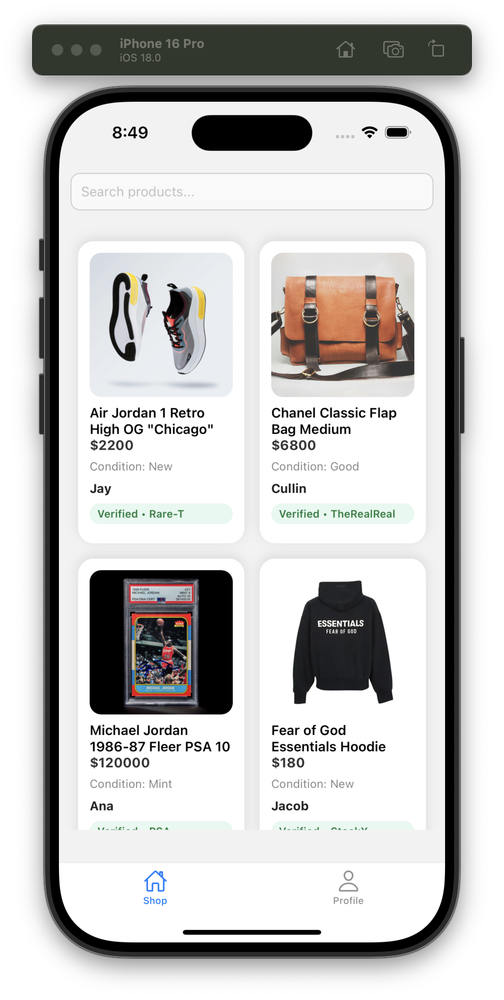
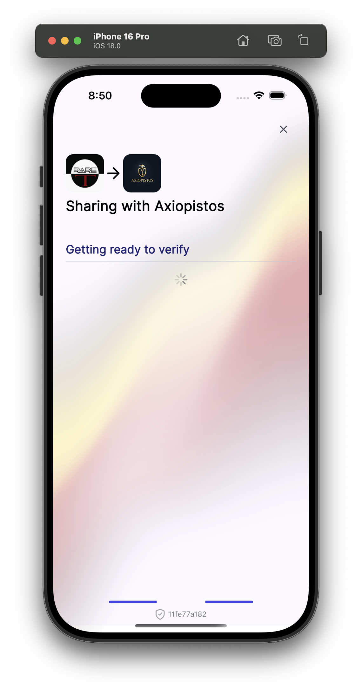

## Get started with Axiopistos


 

<section style="max-width:800px; margin: 40px auto; font-family: Arial, sans-serif; line-height:1.6;">
  <h2>Axiopistos – Verifiable Collectibles Marketplace</h2>
  <p>
    Axiopistos is a next-gen marketplace for collectibles, combining <strong>zkTLS-backed proofs</strong> and Reclaim-style verifications to ensure authenticity, provenance, and privacy. 
  </p>
  <p>
    It solves the problem of <strong>unverified purchases</strong> in collectibles marketplaces. Every listing carries provable purchase history, with one-tap verification and notarized order-matching for a frictionless, fraud-resistant experience.
  </p>
</section>

<h2>Installation</h2>

1. Install dependencies

   ```bash
   npm install
   ```

2. Start the app (only IOS for now..)

   ```bash
   npx expo run:ios
   ```
